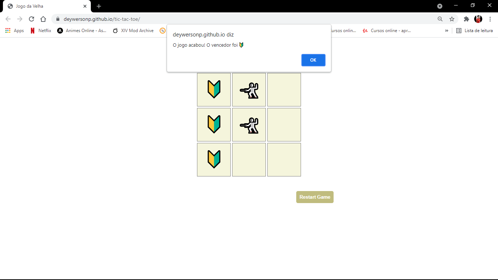

<h1 align="center">
 Tic-Tac-Toe Game
</h1>

  <a href="#-project">Project</a>&nbsp;&nbsp;&nbsp;|&nbsp;&nbsp;&nbsp;
  <a href="#-technologies">Technologies</a>&nbsp;&nbsp;&nbsp;|&nbsp;&nbsp;&nbsp;
  <a href="#-services-used">Services Used</a>&nbsp;&nbsp;&nbsp;|&nbsp;&nbsp;&nbsp;
  <a href="#-getting-started">Getting Started</a>&nbsp;&nbsp;&nbsp;|&nbsp;&nbsp;&nbsp;
  <a href="#-how-to-use">How To Use</a>&nbsp;&nbsp;&nbsp;|&nbsp;&nbsp;&nbsp;
  <a href="#-features">Features</a>&nbsp;&nbsp;&nbsp;

 

 

  

## 💻 Project

Tic-Tac-Toe Game is a project based on tic-tac-toe, developed using the knowleges of HMTL, CSS and JS adquired at "Programador BR" course.

 

This application is hosted on GitHub Pages, [click here to see it](https://deywersonp.github.io/tic-tac-toe/).

  

## 🚀 Technologies

This project was developed using these techs:

- [HTML](https://developer.mozilla.org/pt-BR/docs/Web/HTML)
- [CSS](https://developer.mozilla.org/pt-BR/docs/Web/CSS)
- [JavaScript](https://developer.mozilla.org/pt-BR/docs/Web/JavaScript)

 

## 👨‍🔧 Services Used

- GitHub
- [GitHub Pages](https://pages.github.com/)

 

## 🎮 Getting Started

If you want run this code, you can start cloning the repository using HTTP or SSH key.

- Open your git
- Type `git clone`
- Insert the HTTP or SSH key (on windows, shift + insert to paste on gitBash)
- You can find this HTTP or SSH Key by clicking on `Code` on the top right in this repository

- Once cloned you can open the project in your IDE and open the archive `index.html` on your browser.

  

## 📌 How to Use

### 1 - When you access the project, you will see the home page

### 2 - On this page you can click to put a symbol. Player 1 - Shield / Player 2 - Sword. If a sequence of 3 identical symbols occurs, the game over occurs. 

### 3 - If all fields are completed and there is no winner, a tie will be declared

### 4 - It is possible to restart the game at any time

### Invite friends and see who's the best player!
 
 

## 🕵 Features

The main features of the application are:

 - Fill in the fields with symbols
 - Present a winner when a 3-symbol streak occurs
 - Decide a tie when all fields are filled and there is no winner
 
 

 > In case of sensitive bugs like security vulnerabilities, please contact
 > <a href = "mailto:deywerson.pereira@gmail.com">deywerson.pereira@gmail.com</a> directly instead of using issue tracker. We value your effort
 > to improve the security and privacy of this project!
  
 
---
  

      
Please follow on github and join us! Thanks for visiting me and good coding!

Made with ♥ by <a href="https://github.com/deywersonp">Deywerson Pereira</a>

